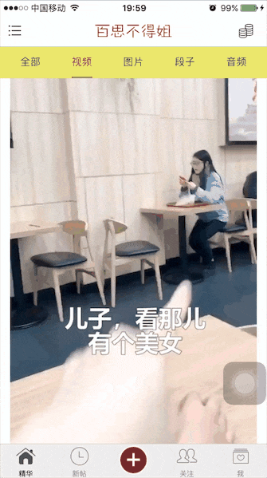
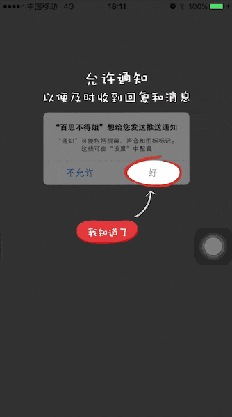
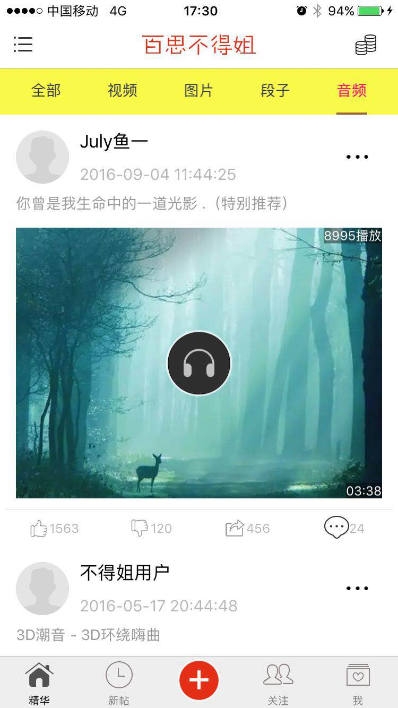
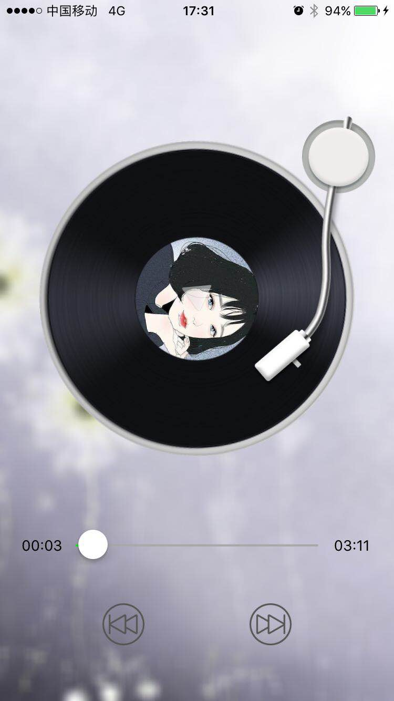
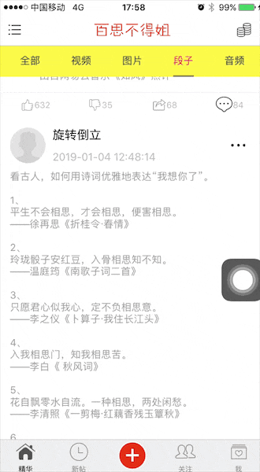
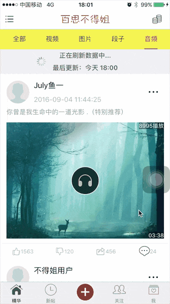
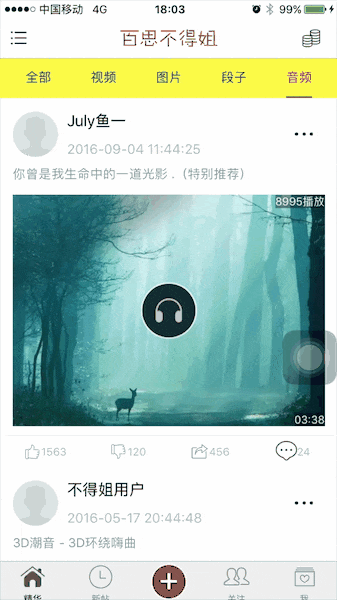
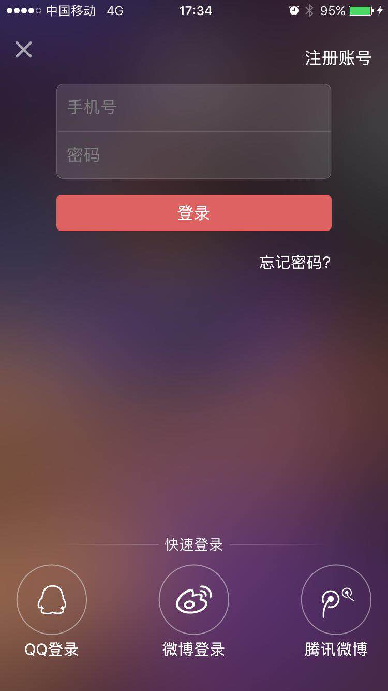
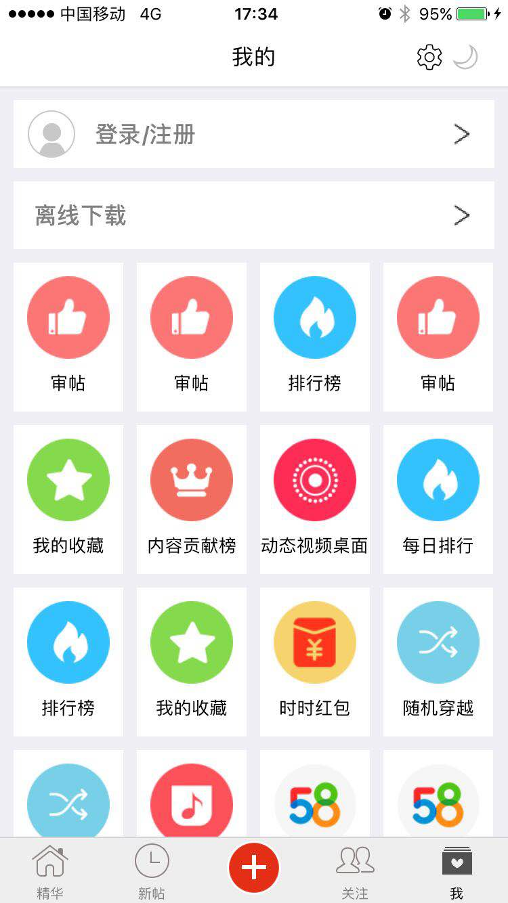

### [个人博客](https://nshunjian.github.io)

- [https://nshunjian.github.io](https://nshunjian.github.io)

# IOSBSJProject
IOSBSJProject 完整可上线项目 包含新闻浏览, 视屏播放, 音频播放, 音乐播放 , 没有导航栏,自定义导航栏,字体适配屏幕,空白页展示,空白页,导航条颜色渐变,导航条高度渐变,YYText 使用,列表的展开和收起等等

[<h2>首页</h2>](#)

|
|
|
|
|
|
|
|
|
|
|
|
|
|
|

 
 

